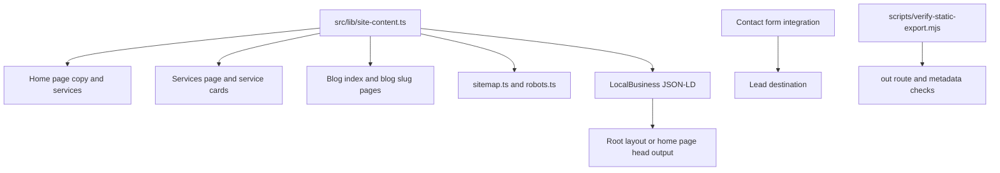

# Friendly Landscaping SEO, Copy, and Launch Readiness Fix Plan

## Summary

This plan fixes the audit findings that keep the site from being launch-ready: broken crawl paths, simulated lead capture, thin local SEO signals, stale promo artifacts, generic copy, and templated presentation patterns. The implementation keeps the existing Next.js App Router and static export model, then makes each public route concrete, crawlable, and locally relevant for a Madison landscaping business.

---

## Problem Frame

The current site has a credible visual base, but search engines and visitors see several weak signals: generic titles, missing LocalBusiness schema, no sitemap or robots output, a blog index that links to missing pages, and a contact form that reports success without sending a lead. The copy also leans on broad claims like "premium", "high-end", and "most trusted" instead of specific services, service area, process, proof, and project details.

---

## Requirements

**Launch correctness**

- R1. Every visible internal link must resolve to a generated static route or be removed from the UI.
- R2. The contact form must either submit to a real lead destination or clearly avoid claiming a successful send.
- R3. Stale generated pages such as `out/spring-promo.html` must not survive the export/deploy workflow.

**SEO foundations**

- R4. Each public route must have unique metadata aligned to its search intent and location.
- R5. The site must generate `robots.txt` and `sitemap.xml` through App Router metadata routes.
- R6. The root layout must provide canonical URL support, Open Graph defaults, and reusable business metadata.
- R7. The site must include valid local-business structured data for Friendly Landscaping LLC without inventing unknown address, hours, review, or rating data.
- R8. Images that communicate services or projects must use descriptive alt text tied to the actual content shown.

**Copy and content quality**

- R9. Homepage and service copy must prioritize concrete Madison-area landscaping services over generic luxury language.
- R10. Promotional claims must be removed or made truthful with terms, dates, and one consistent offer.
- R11. The services page must support future service-specific SEO pages without duplicating service data in multiple components.
- R12. The portfolio must not display "coming soon" content as if it were a project.

**Design and interaction quality**

- R13. The homepage must reduce templated centered-section and equal-card-grid patterns while preserving the brand palette and photographic assets.
- R14. Scroll animation must respect reduced-motion preferences and avoid making exported HTML appear initially empty.
- R15. Interactive labels and CTAs must stay concise, local, and conversion-oriented across mobile and desktop.

---

## Key Technical Decisions

- **Keep static export:** The project already uses `output: 'export'` in `next.config.ts`, so all fixes should remain compatible with static generation. Dynamic blog routes must use `generateStaticParams`, or the blog should stay as non-linked teasers until real posts exist.
- **Centralize public content:** Move repeated services, posts, business facts, and route metadata into a shared module such as `src/lib/site-content.ts`. This prevents homepage, service page, sitemap, and structured data from drifting.
- **Use App Router metadata primitives:** Implement `src/app/robots.ts`, `src/app/sitemap.ts`, route `metadata`, and `generateMetadata` where route params are needed. Context7 confirmed these are the current Next.js App Router patterns for metadata routes and dynamic static routes.
- **Use honest local-business schema:** Emit `LandscapingBusiness` JSON-LD with known name, URL, phone, area served, services, and image. Do not fabricate street address, opening hours, ratings, reviews, founding date, or licenses unless the business supplies them.
- **Prefer real articles or no article links:** A blog index with broken article URLs is worse than no blog. Either add two static article pages matching the current slugs or convert the blog cards into non-clickable planned topics until content is written.
- **Treat `out/` as generated:** Because `/out/` is gitignored, stale export artifacts should be handled by clean build workflow and verification scripts, not source edits to generated files.

---

## High-Level Technical Design

The shared content module should be plain TypeScript data, not a CMS abstraction. It should contain only facts the site can stand behind: service names, summaries, image paths, route paths, service-area language, phone number, and blog post metadata/content if article pages are shipped.

---

## Implementation Units

### U1. Centralize site facts and route content

- **Goal:** Create a single source of truth for business details, routes, services, portfolio items, and optional blog posts.
- **Files:** `src/lib/site-content.ts`, `src/app/page.tsx`, `src/app/services/page.tsx`, `src/app/blog/page.tsx`, `src/app/portfolio/page.tsx`, `src/components/Footer.tsx`.
- **Patterns:** Keep data serializable and static-export friendly. Reuse current image assets under `public/images/`.
- **Test Scenarios:**
  - `src/lib/site-content.ts` exports all service entries currently rendered on homepage and services page.
  - Homepage and services page render the same service names from shared data.
  - Footer uses the same phone and service-area copy as contact and schema data.
  - Portfolio no longer renders "More Projects Coming Soon" as a project card.
- **Verification:** `npm run lint`; `npm run build`; inspect generated route text in `out/*.txt` for consistent service names and phone number.

### U2. Add route metadata, sitemap, robots, canonical support, and structured data

- **Goal:** Make every public page crawlable with unique metadata and local-business signals.
- **Files:** `src/app/layout.tsx`, `src/app/page.tsx`, `src/app/about/page.tsx`, `src/app/services/page.tsx`, `src/app/portfolio/page.tsx`, `src/app/blog/page.tsx`, `src/app/contact/page.tsx`, `src/app/sitemap.ts`, `src/app/robots.ts`, `src/components/LocalBusinessJsonLd.tsx`, `src/lib/site-content.ts`.
- **Patterns:** Use `Metadata` exports for static pages, `metadataBase` for canonical and OG URLs, `MetadataRoute.Sitemap` and `MetadataRoute.Robots` for generated files, and an inert JSON-LD script component for schema.
- **Test Scenarios:**
  - `out/sitemap.xml` includes `/`, `/about`, `/services`, `/portfolio`, `/blog`, `/contact`, and any real blog article routes.
  - `out/robots.txt` allows normal crawling and points to the sitemap URL.
  - Each exported HTML page has one relevant title and meta description.
  - LocalBusiness JSON-LD parses as JSON and contains only known facts.
  - Open Graph defaults include a real image path from `public/images/`.
- **Verification:** `npm run build`; inspect `out/sitemap.xml`, `out/robots.txt`, and exported page head metadata; run the static export verification script from U6.

### U3. Resolve blog and promo route problems

- **Goal:** Remove broken crawl paths and stale seasonal promotion inconsistency.
- **Files:** `src/app/blog/page.tsx`, `src/app/blog/[slug]/page.tsx`, `src/lib/site-content.ts`, `src/app/page.tsx`, `src/components/Header.tsx`, `src/components/Footer.tsx`, `scripts/verify-static-export.mjs`.
- **Patterns:** For real articles, use `generateStaticParams` and `generateMetadata` so static export can generate every slug. If full article content is not available, remove article links and keep the blog as an index of planned topics.
- **Test Scenarios:**
  - If article pages ship, `/blog/5-native-plants-madison` and `/blog/prepare-lawn-spring-thaw` are generated and linked.
  - If article pages do not ship, the blog index contains no links to missing `/blog/*` pages.
  - No source component links to `/spring-promo` unless a current source route exists.
  - Homepage promotional copy is absent or matches one current offer with terms.
- **Verification:** `npm run build`; run export link checks in U6; grep source for `/spring-promo` and stale April/discount claims.

### U4. Wire the contact form to a real lead path

- **Goal:** Prevent fake success states and make quote requests operational.
- **Files:** `src/app/contact/page.tsx`, `.env.example` if present or `README.md`, optional `src/app/api/contact/route.ts` only if static export is abandoned.
- **Patterns:** Because `output: 'export'` cannot host a Next route handler at runtime, use a static-compatible provider endpoint, mail form service, CRM embed, or documented `mailto:` fallback. Keep server-only API routes out unless the deploy target changes from static export.
- **Test Scenarios:**
  - Submitting required fields sends data to the configured destination in the chosen environment.
  - Failure state is visible when the provider rejects or network submission fails.
  - Success copy appears only after a provider acknowledgement.
  - The form preserves phone-first conversion with `(608) 481-9571` visible.
- **Verification:** `npm run lint`; `npm run build`; manual browser test against the configured provider or a documented staging endpoint.

### U5. Rewrite copy and reshape the highest-impact presentation patterns

- **Goal:** Make the site read like a specific Madison landscaping company rather than a generic generated landing page.
- **Files:** `src/app/page.tsx`, `src/app/services/page.tsx`, `src/app/about/page.tsx`, `src/app/portfolio/page.tsx`, `src/app/contact/page.tsx`, `src/components/Footer.tsx`, `src/app/globals.css`, `src/components/AnimatedSection.tsx`.
- **Patterns:** Keep Inter and Merriweather, the green/beige palette, and the existing photos. Replace broad prestige claims with concrete service, service-area, process, material, and ecological language.
- **Test Scenarios:**
  - Homepage H1 or lead copy includes Madison plus core services such as landscape design, patios, drainage, native gardens, or seasonal cleanup.
  - Service descriptions avoid unsupported superlatives and duplicate filler.
  - CTA labels are short and action-specific, such as "Request a quote" or "Call for a quote".
  - Portfolio cards describe actual visible project types and use descriptive alt text.
  - Reduced-motion users do not receive scroll fade-up motion.
- **Verification:** `npm run lint`; `npm run build`; manual responsive review at 320, 375, 414, 768, and desktop widths.

### U6. Add launch verification for static export hygiene

- **Goal:** Make regressions visible before deploy: missing pages, stale generated routes, broken internal links, and missing SEO files.
- **Files:** `scripts/verify-static-export.mjs`, `package.json`, `README.md`.
- **Patterns:** Use a small Node script with built-in modules so no new test framework is required. The script should inspect `out/` after `npm run build`.
- **Test Scenarios:**
  - Fails when a source link points to a missing exported route.
  - Fails when `out/sitemap.xml` or `out/robots.txt` is missing.
  - Fails when known stale paths such as `/spring-promo` exist without matching source route intent.
  - Fails when blog links point to ungenerated slug pages.
  - Fails when core pages lack title or description tags.
- **Verification:** Add a package script such as `verify:export`; run `npm run build` followed by `npm run verify:export`.

---

## Scope Boundaries

- This plan does not invent ratings, testimonials, license numbers, awards, project counts, addresses, or business hours.
- This plan does not introduce a CMS. Static TypeScript content is enough for the current site size.
- This plan does not require a full visual redesign. It targets the highest-signal layout and copy tells from the audit.
- This plan does not require abandoning static export unless the chosen contact-form provider requires server-side handling.
- Image compression is adjacent but not core to the audit. It can be handled after launch-readiness fixes unless build or page-speed review makes it blocking.

---

## System-Wide Impact

The main cross-cutting change is centralizing public business facts. After that change, page copy, sitemap, schema, footer, and contact content should all read from the same source. Static export remains the deployment constraint, which affects blog routing and contact-form architecture.

---

## Risks & Dependencies

| Risk | Impact | Mitigation |
| --- | --- | --- |
| Unknown canonical domain | Canonical, sitemap, robots, and schema URLs may need later correction | Use one configured site URL constant and document where to update it before deploy |
| Unknown contact provider | Form wiring cannot be fully implemented without a destination | Choose a static-compatible provider or temporarily downgrade to phone/mail conversion copy |
| Blog content may be too thin | Thin article pages can hurt trust and waste crawl budget | Ship real articles only if useful content exists; otherwise remove slug links |
| Seasonal offer uncertainty | Stale discounts can mislead visitors | Remove promo copy unless current terms are supplied |
| Static export constraints | Route handlers and dynamic params can break build | Keep dynamic routes generated with `generateStaticParams` and avoid runtime-only App Router features |

---

## Acceptance Examples

- AE1. Given a crawler requests `sitemap.xml`, when the site has been exported, then the sitemap lists every public route that exists in source and no stale promo route.
- AE2. Given a visitor clicks a blog card, when article pages are enabled, then the target slug renders a full static article with unique metadata.
- AE3. Given article pages are not enabled, when a visitor views the blog index, then there are no clickable links to missing `/blog/*` routes.
- AE4. Given a visitor submits the contact form, when the configured provider returns success, then the UI shows a success message only after acknowledgement.
- AE5. Given a visitor has reduced-motion enabled, when they load the homepage, then content is visible without scroll-triggered fade-up animation.
- AE6. Given the homepage is viewed on mobile, when CTA labels wrap pressure increases, then clickable labels remain concise and do not break into awkward two-line affordances.

---

## Documentation / Operational Notes

Update `README.md` with the site URL constant, contact-form provider configuration, and the launch verification command. If the contact provider needs environment variables, document names and local setup without committing secrets.

---

## Sources / Research

- Audit findings from the Hallmark pass in this session: broken blog links, simulated form success, stale `out/spring-promo.html`, missing route-level SEO, missing sitemap/robots/schema, generic copy, card-grid repetition, and scroll-animation overuse.
- Next.js App Router documentation via Context7 for `/vercel/next.js`: metadata exports, `generateMetadata`, `sitemap.ts`, `robots.ts`, static export limitations, and `generateStaticParams` for static dynamic routes.
- Existing repo patterns: `src/app/layout.tsx` root metadata and fonts, `src/app/page.tsx` service grid and hero, `src/app/blog/page.tsx` blog slug links, `src/app/contact/page.tsx` simulated form submission, `next.config.ts` static export configuration, and `.gitignore` excluding `out/`.
